# 🏎️ Formula 1 Data Analysis Project

This project provides an end-to-end analysis of Formula 1 racing data.  
It includes data cleaning, exploratory analysis, and insightful visualizations to help understand driver and car performance across laps and sessions.

## ✨ Features
- **Data ingestion & cleaning**: Handling multiple sessions/laps data.
- **Visualizations**: Track maps, braking/acceleration heatmaps, gear usage per lap, and performance trends.

## 🛠️ Technologies
- Python (pandas, numpy)
- Matplotlib / seaboan for visualizations
- Jupyter Notebooks for interactive analysis

## importing the libraries
```python
import pandas as pd
import numpy as np
import matplotlib.pyplot as plt
from matplotlib.collections import LineCollection
import seaborn as sns
```

## cleaning the data 
```python 
vel_cols = ["velocity_X", "velocity_Y", "velocity_Z"]
if all(c in df.columns for c in vel_cols):
    df["Speed_kmh"] = np.sqrt(df["velocity_X"]**2 + df["velocity_Y"]**2 + df["velocity_Z"]**2) * 3.6
    df.drop(columns=vel_cols, inplace=True)
    
    
pressure_pascal = ["tyre_press_0", "tyre_press_1", "tyre_press_2", "tyre_press_3"]
for col in pressure_pascal:
    if col in df.columns:
        df[col] = df[col] / 100000.0  # 1 bar = 100,000 Pascal
        
for col in ["oil_press", "fuel_press", "water_press"]:
    if col in df.columns:
        df[col] = df[col] / 100000.0 
lap_cols = ["lapIndex", "lap_number", "lapNum"]
lap_col = next((c for c in lap_cols if c in df.columns), None)

if lap_col:
    min_lap = df[lap_col].min()
    max_lap = df[lap_col].max()
    df = df[(df[lap_col] != min_lap) & (df[lap_col] != max_lap)]
    
df["LapDistance_m"] = df["lap_distance"] * 0.3048

df = df.dropna()
df = df.drop_duplicates().reset_index(drop=True)
```
## visualizations

### 1. Maximum Speed per Lap  
``` python
 import seaborn as sns
import matplotlib.pyplot as plt

plt.figure(figsize=(8, 4))  

barplot = sns.barplot(data=max_Speed, x='lapNum', y='Speed_kmh', palette='viridis')

plt.title('Maximum Speed per Lap', fontsize=14)
plt.xlabel('Lap Number', fontsize=12)
plt.ylabel('Max Speed (km/h)', fontsize=12)

for index, row in max_Speed.iterrows():
    barplot.text(row.name, row['Speed_kmh'] + 1, f"{row['Speed_kmh']:.1f}", 
                 color='black', ha='center', fontsize=10)

plt.tight_layout()
plt.show()
```

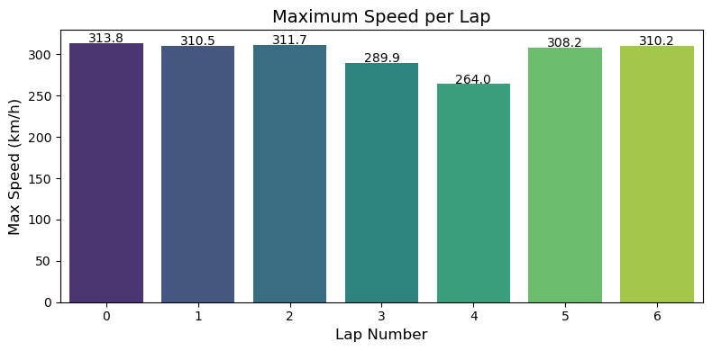

#### insights
- This bar chart shows the highest speed reached in each lap. It's a quick way to compare performance across laps and spot any drop-offs due to traffic, tyre degradation, or setup changes. For example, lap 4 shows a noticeable dip in top speed, which could indicate a lift-off or mechanical limitation.

### 2. Minimum Speed per Lap
```python
import seaborn as sns
import matplotlib.pyplot as plt

plt.figure(figsize=(8, 4)) 

barplot = sns.barplot(data=min_Speed, x='lapNum', y='Speed_kmh', palette='mako')


plt.title('Minimum Speed per Lap', fontsize=14)
plt.xlabel('Lap Number', fontsize=12)
plt.ylabel('Min Speed (km/h)', fontsize=12)


for index, row in min_Speed.iterrows():
    barplot.text(row.name, row['Speed_kmh'] + 1, f"{row['Speed_kmh']:.1f}", 
                 color='black', ha='center', fontsize=10)

plt.tight_layout()
plt.show()
```


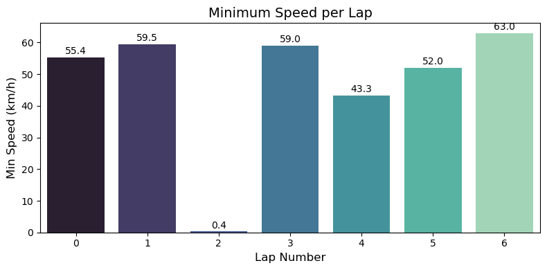

#### insights
- This bar chart displays the slowest speed recorded during each lap, highlighting moments of heavy braking, cornering, or potential power delivery issues. While most laps maintain a consistent minimum speed, lap 2 stands out with an unusually slow figure of 0.4 km/h, suggesting a near stop or possibly a spin that required downshifting and recovery.

### 3. Average Speed per Lap  
```python
plt.figure(figsize=(8, 4))  

barplot = sns.barplot(data=avg_Speed, x='lapNum', y='Speed_kmh', palette='cubehelix')


plt.title('Average Speed per Lap', fontsize=14)
plt.xlabel('Lap Number', fontsize=12)
plt.ylabel('Average Speed (km/h)', fontsize=12)


for index, row in avg_Speed.iterrows():
    barplot.text(row.name, row['Speed_kmh'] + 1, f"{row['Speed_kmh']:.1f}", 
                 color='black', ha='center', fontsize=10)

plt.tight_layout()
plt.show()
```

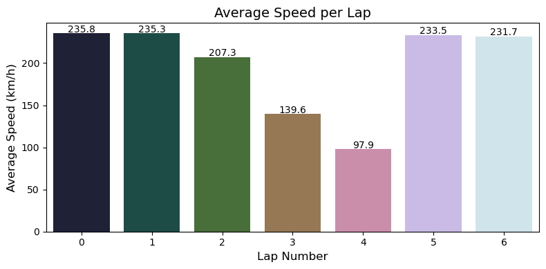

#### insigts
- This chart illustrates the average speed maintained during each lap, offering a broader view of overall pace and consistency. While laps 0, 1, 5, and 6 show stable performance around 230–235 km/h, laps 3 and 4 reveal significant drops — possibly due to traffic, tyre wear, or strategic slowdowns. Lap 2 also shows a moderate dip, suggesting a brief issue or adjustment.

### 4. Lap Time Progression
```python
# Set figure size for better visibility
plt.figure(figsize=(12, 6))
# Plot lap_time against lap_number to visualize performance over time
sns.lineplot(data=df, x='lapNum', y='lap_time', marker='o')
# Add title and axis labels
plt.title('Lap Time Progression Throughout the Race', fontsize=14)
plt.xlabel('Lap Number')
plt.ylabel('Lap Time (seconds)')
# Add grid for easier reading
plt.grid(True)
# Adjust layout to prevent clipping
plt.tight_layout()
# Display the plot
plt.show()
```  

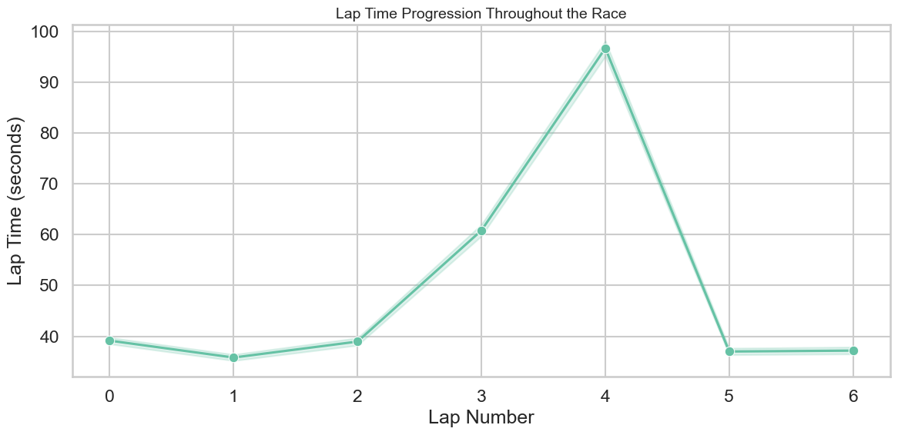
#### insigts
- This line chart tracks lap times throughout the race, revealing consistency and anomalies. Most laps hover around 40–42 seconds, but lap 4 shows a dramatic spike to nearly 100 seconds — likely due to a pit stop, spin, or technical issue. The quick recovery in lap 5 suggests the problem was resolved immediately.

### 5. Tyre Pressure Heatmap 
```python
plt.figure(figsize=(8, 5))
sns.heatmap(avg_press_for_every_tyre_bar.T, annot=True, cmap='coolwarm', fmt=".1f")

plt.title('Tyre Pressure Heatmap per Lap', fontsize=16)
plt.xlabel('Lap Number')
plt.ylabel('Tyre')
plt.tight_layout()
plt.show()
``` 

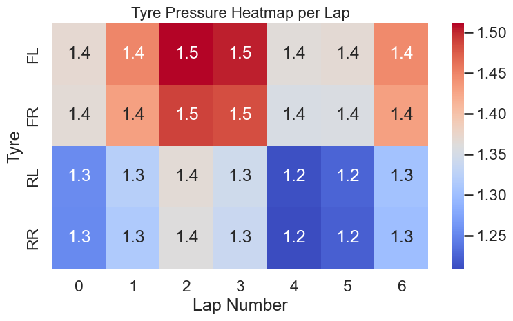
#### insigts 
- This heatmap visualizes the pressure of all four tyres (FL, FR, RL, RR) across multiple laps. Warmer colors indicate higher pressure, while cooler tones reflect lower values. The chart helps identify how tyre pressure evolves during the race — whether due to temperature changes, driving style, or setup. Lap 2 shows a noticeable increase across all tyres, while laps 4 and 5 reveal a drop in rear pressures, possibly linked to cooling or reduced load.

### 6. Average Tyre Temperature per Lap
```python
plt.figure(figsize=(8, 5))

sns.heatmap(avg_temp_for_every_tyre_C.T, annot=True, cmap='coolwarm', fmt=".1f", linewidths=0.5, linecolor='gray')

plt.title('Average Tyre Temperature per Lap', fontsize=16)
plt.xlabel('Lap Number')
plt.ylabel('Tyre')

plt.tight_layout()
plt.show()
```
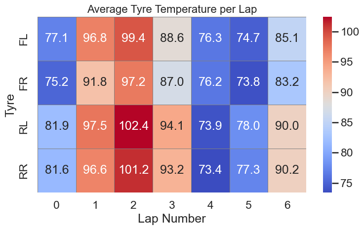
#### insigts
- This heatmap shows the average temperature of each tyre (FL, FR, RL, RR) across all laps. It helps visualize thermal load and tyre behavior under different conditions. Lap 2 and lap 3 show elevated temperatures, especially on the rear tyres, which may indicate aggressive driving or reduced cooling. In contrast, lap 4 shows a noticeable drop, possibly due to a slower pace or cooler track conditions.

### 7. Ambient Temperature per Lap  
```python
plt.figure(figsize=(10,5))
plt.plot(ambient_per_lap['lapNum'], ambient_per_lap['avg_ambient_temp'], marker='o')
plt.title('Average Ambient Temperature per Lap')
plt.xlabel('Lap Number')
plt.ylabel('Ambient Temperature (°C)')
plt.grid(True)
plt.show()
```
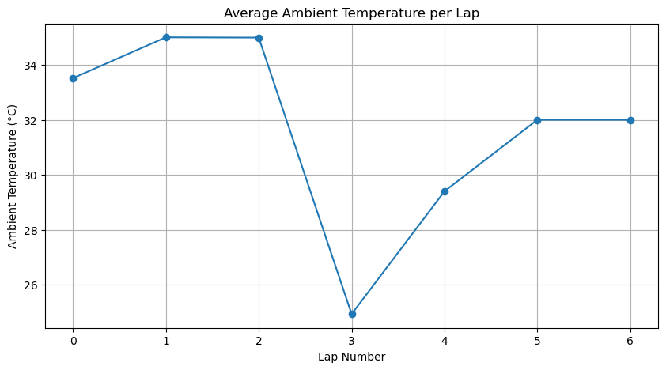
#### insigts
- This line chart tracks the ambient temperature across laps, offering insight into external conditions that may affect tyre behavior, engine cooling, and overall car performance. Lap 3 shows a sharp drop to ~25°C, followed by a gradual recovery. Such fluctuations can influence grip levels and setup decisions during the race.

### 8. Average Fuel Consumption per Lap  
```python
# Set style
sns.set_theme(style="whitegrid")

plt.figure(figsize=(8, 5))
sns.lineplot(
    x="lapNum", y="fuel", data=avg_fual_per_lap,
    marker="o", linewidth=2.5, color="royalblue"
)
# Fill area under the curve for better effect
plt.fill_between(avg_fual_per_lap["lapNum"], avg_fual_per_lap["fuel"], alpha=0.2, color="royalblue")
for x, y in zip(avg_fual_per_lap["lapNum"], avg_fual_per_lap["fuel"]):
    plt.text(x, y+0.5, f"{y:.1f}", ha='center', va='bottom', fontsize=10, color="black")
# Titles and labels
plt.title("Average Fuel Consumption per Lap", fontsize=14, weight="bold")
plt.xlabel("Lap Number", fontsize=12)
plt.ylabel("Average Fuel", fontsize=12)
plt.ylim(0, 27)
plt.show()
```
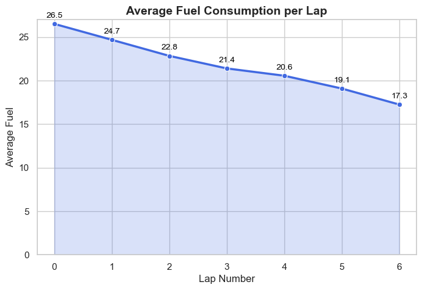
#### insigts
- This line graph shows how fuel usage decreases progressively across laps. The downward trend reflects reduced car weight as fuel burns off, which can improve lap times and handling. Lap 0 starts at 26.5 units, dropping steadily to 17.3 by lap 6 — a useful indicator for strategy planning and efficiency tracking.

### 9. Oil, Fuel, and Water Pressure per Lap
```python
# Set visual style
sns.set(style="whitegrid", context="talk", palette="Set2")
plt.figure(figsize=(10, 6))

# Plot each pressure type with shaded band and value labels
for pressure_type, color in zip(
    ["oil_press", "fuel_press", "water_press"],
    sns.color_palette("Set2", n_colors=3)
):
    values = press_effect_per_lap[pressure_type]
    laps = press_effect_per_lap.index

    # Draw line with markers
    plt.plot(laps, values, marker="o", color=color, linewidth=2)
    
    # Add shaded band around the line
    plt.fill_between(laps, values - 0.2, values + 0.2, color=color, alpha=0.1)

    # Annotate each point with its value
    for lap, val in zip(laps, values):
        plt.text(lap, val + 0.3, f"{val:.1f}", color=color, ha="center", fontsize=10)

# Title and axis labels with unit clarification
plt.title("Average Oil, Fuel and Water Pressure per Lap (in bar)", fontsize=18)
plt.xlabel("Lap Number", fontsize=14)
plt.ylabel("Pressure (bar)", fontsize=14)

# Legend positioned outside the plot
plt.legend(["Oil Pressure" , "Water Pressure","Fuel Pressure"],
           title="Pressure Type", bbox_to_anchor=(1.02, 1), loc="upper left")

plt.tight_layout()
plt.show()
```
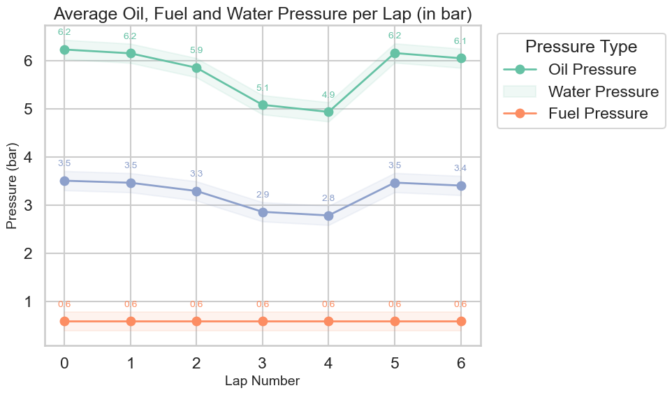
#### insigts  
- This multi-line chart compares three critical pressure metrics across laps: oil, water, and fuel. Oil pressure shows slight fluctuations, with a dip in lap 3 possibly linked to engine load or cooling. Water pressure remains relatively stable, while fuel pressure is flat across all laps — indicating consistent delivery. This plot helps monitor mechanical health and detect early signs of system imbalance.

### 10. Average RPM per Lap 
```python
# Calculate average RPM per lap
rpm_per_lap = df.groupby('lapIndex')['rpm'].mean().reset_index(name='avg_rpm')

plt.figure(figsize=(10,5))

# Draw the line plot with gentle color
plt.plot(rpm_per_lap['lapIndex'], rpm_per_lap['avg_rpm'], 
         marker='o', color='steelblue', linewidth=2)

# Add the numbers above each point
for x, y in zip(rpm_per_lap['lapIndex'], rpm_per_lap['avg_rpm']):
    plt.text(x, y + (rpm_per_lap['avg_rpm'].max()*0.01),  # small offset above
             f'{y:.0f}', ha='center', va='bottom', fontsize=10, color='black')

# Title and labels
plt.title('RPMs', fontsize=16, fontweight='bold')
plt.xlabel('Lap Index', fontsize=14)
plt.ylabel('Average RPM', fontsize=14)

plt.grid(True, linestyle='--', alpha=0.7)
plt.tight_layout()
plt.show()
```
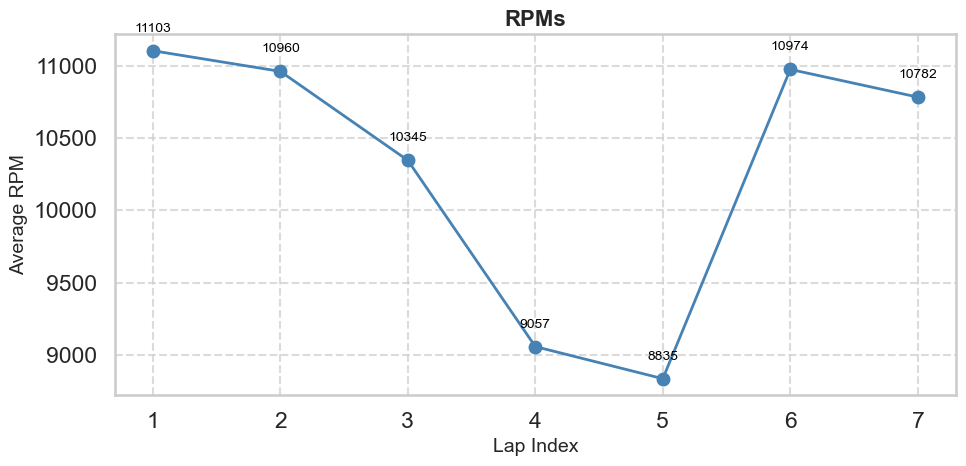
#### insigts
- This line graph shows the average engine revolutions per minute (RPM) across laps, offering insight into throttle usage and gear behavior. The chart reveals a dip in laps 4 and 5, possibly due to slower pace or gear shifts during technical sections. High RPMs in laps 1, 2, and 6 suggest aggressive acceleration and optimal power delivery.

### 11. Throttle & Brake Percentage per Lap 
```python
# Plot both throttle and brake percentage per lap
plt.figure(figsize=(12, 6))

plt.plot(
    lap_percentages.index, lap_percentages['throttle_percentage'],
    marker='o', linewidth=2, label='Throttle %', color='green'
)
plt.plot(
    lap_percentages.index, lap_percentages['brake_percentage'],
    marker='s', linewidth=2, label='Brake %', color='red'
)

# Add values above each point (optional)
for x, y in zip(lap_percentages.index, lap_percentages['throttle_percentage']):
    plt.text(x, y + 1, f'{y:.1f}%', ha='center', va='bottom', fontsize=9, color='green')
for x, y in zip(lap_percentages.index, lap_percentages['brake_percentage']):
    plt.text(x, y + 1, f'{y:.1f}%', ha='center', va='bottom', fontsize=9, color='red')

plt.title('Average Throttle & Brake Percentage per Lap', fontsize=16, fontweight='bold')
plt.xlabel('Lap Number', fontsize=12)
plt.ylabel('Percentage (%)', fontsize=12)
plt.grid(True, linestyle='--', alpha=0.3)
plt.legend()
plt.tight_layout()
plt.show()
```
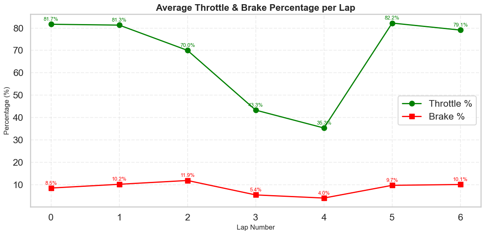 
#### insigts
- This dual-line chart compares average throttle and brake usage across laps, offering insight into driving style and car control. Throttle percentage drops sharply in lap 4 (to 35.6%), suggesting a slowdown or technical section, while brake usage remains low overall — peaking slightly in lap 3. The contrast between green (throttle) and red (brake) lines helps visualize balance and aggression in each lap.

### 12. Most Used Gear per Lap  
```python
# Calculate the most used gear for each lap
gears_per_lap = (
    df.groupby('lapNum')['gear']
      .apply(lambda x: x.value_counts().idxmax())
      .reset_index(name='most_used_gear')
)

plt.figure(figsize=(10,6))

# Scatter plot: each point = one lap
plt.scatter(
    gears_per_lap['lapNum'],                 # x-axis: lap number
    gears_per_lap['most_used_gear'],         # y-axis: most used gear
    c=gears_per_lap['most_used_gear'],       # color based on gear value
    cmap='viridis',                          # color palette
    s=80, edgecolors='black'                 # size and edge color of points
)

# Title and labels
plt.title('Most Used Gear per Lap', fontsize=14)
plt.xlabel('Lap Number')
plt.ylabel('Gear')

# Make sure gears are sorted on y-axis
plt.yticks(sorted(gears_per_lap['most_used_gear'].unique()))

# Add a light grid
plt.grid(True, linestyle='--', alpha=0.4)

plt.show()
```
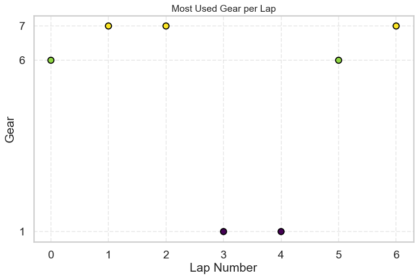
#### insigts
- This scatter plot highlights the most frequently used gear in each lap, offering insight into track layout and driver behavior. Laps 1, 5, and 6 favor higher gears (6–7), suggesting fast sections or long straights. In contrast, laps 3 and 4 show dominant use of gear 1 — likely due to tight corners, traffic, or recovery maneuvers. This plot helps correlate gear selection with lap dynamics.

### 13. Car Path Colored by Track Temperature 
```python
# Extract coordinates and track temperature from the DataFrame
x = df['world_position_X'].values
y = df['world_position_Y'].values
temp = df['track_temp'].values  # Track temperature values

# Create an array of line segments from point to point
points = np.array([x, y]).T.reshape(-1, 1, 2)
segments = np.concatenate([points[:-1], points[1:]], axis=1)

# Create a LineCollection where color is mapped to track temperature
lc = LineCollection(
    segments,
    cmap='plasma',                          # Color map for temperature
    norm=plt.Normalize(temp.min(), temp.max())  # Normalize colors
)
lc.set_array(temp)  # Assign temperature values to the line
lc.set_linewidth(3)  # Line thickness
```
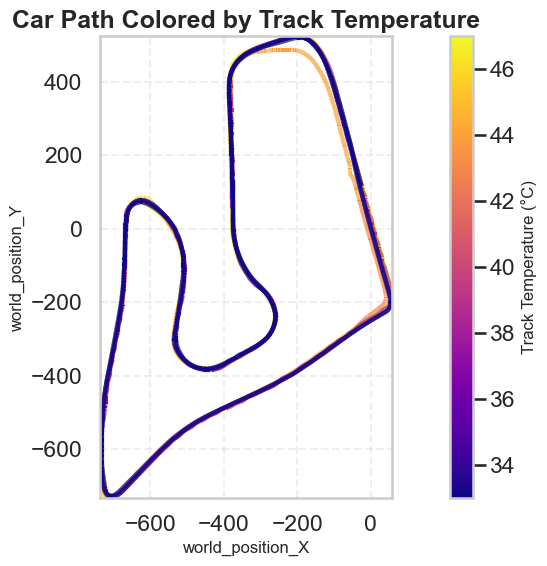
#### insigts 
- This plot maps the car’s trajectory on the circuit, with color gradients representing track surface temperature. Warmer sections (yellow) indicate higher temperatures, which can affect tyre grip and wear, while cooler zones (blue) may offer more stability. This visualization helps correlate driving line with thermal conditions — useful for setup tuning and tyre strategy.

### 14. Track Map Colored by Throttle 
```python
# Create scatter plot of track map colored by throttle
plt.figure(figsize=(10, 6))
sc = plt.scatter(df['world_position_X'], df['world_position_Y'],
                 c=df['throttle'], cmap='Greens', s=2)

plt.colorbar(sc, label='Throttle Position')
plt.title('Track Map Colored by Throttle')
plt.xlabel('X Position')
plt.ylabel('Y Position')
plt.axis('equal')
plt.grid(True)
plt.tight_layout()
plt.show()
```
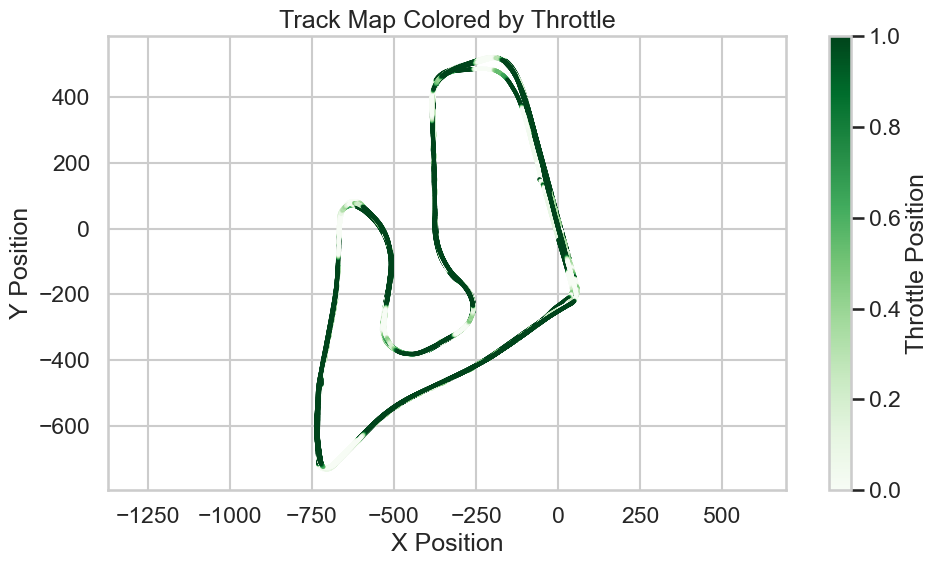
#### insigts  
- This plot overlays throttle input on the car’s path around the circuit. Darker green sections indicate full throttle, while lighter areas show lift-off or partial input. It’s a powerful way to visualize acceleration zones, braking points, and how the driver modulates power through corners. Useful for comparing driving lines and throttle discipline.

### 15. Track Map Colored by Brake Pressure  
``` python
# Create scatter plot of track map colored by brake
plt.figure(figsize=(10, 6))
sc = plt.scatter(df['world_position_X'], df['world_position_Y'],
                 c=df['brake'], cmap='Reds', s=2)

plt.colorbar(sc, label='Brake Pressure')
plt.title('Track Map Colored by Brake')
plt.xlabel('X Position')
plt.ylabel('Y Position')
plt.axis('equal')
plt.grid(True)
plt.tight_layout()
plt.show()
```
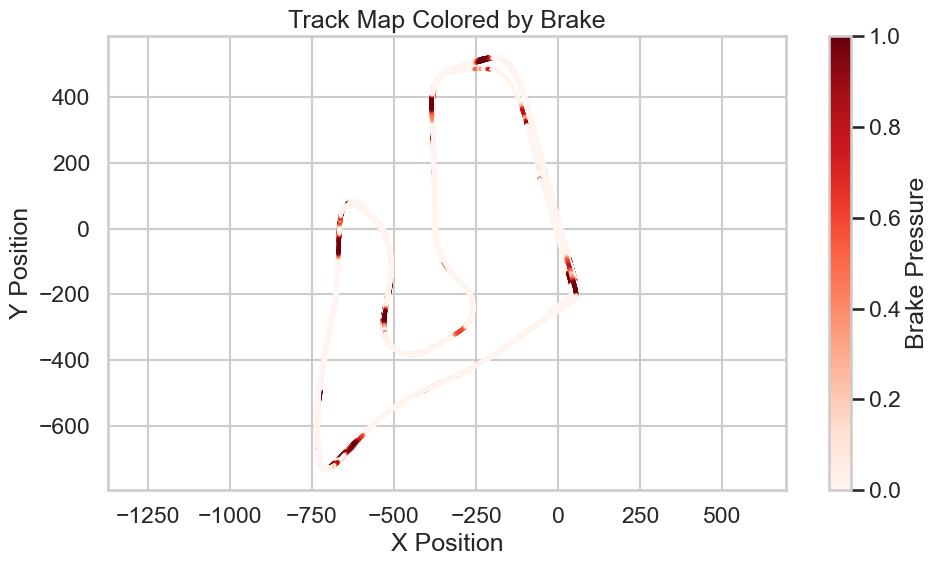
#### insigts
- This plot visualizes brake input along the circuit, with darker red zones indicating heavier braking. It reveals where the driver decelerates most aggressively — typically before tight corners or technical sections. Lighter pink areas show coasting or low-pressure braking. This map helps correlate braking behavior with track layout and can guide setup adjustments or driver coaching.

## ✅ Conclusion

Working with raw telemetry data was challenging — from cleaning inconsistent inputs to designing clear, meaningful visualizations. Some metrics required deep validation and careful tuning to reflect real performance. Despite the difficulties, this project helped me build a more structured, automated approach to motorsport analysis.


